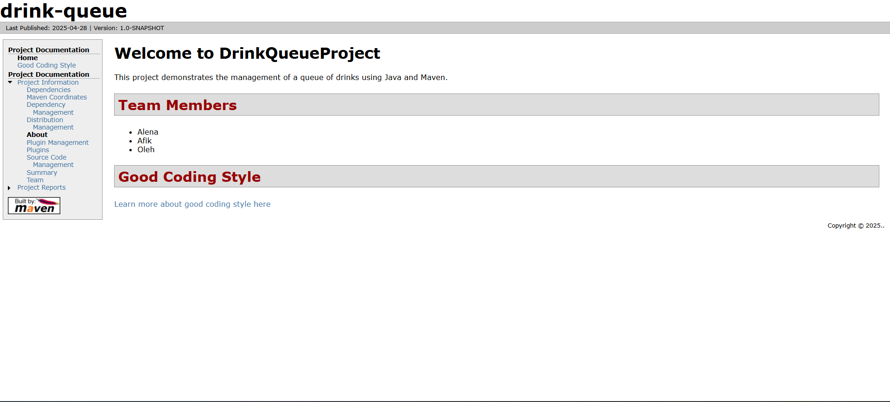
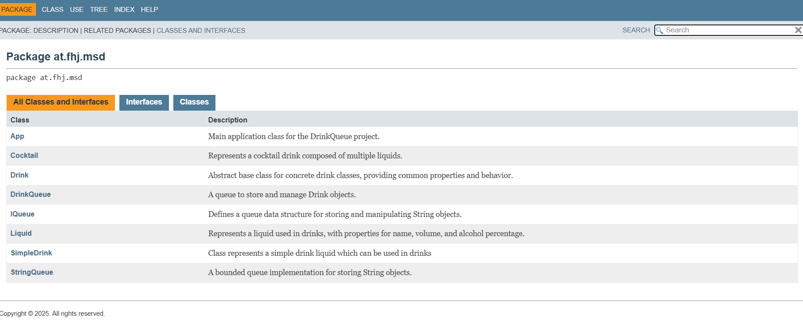
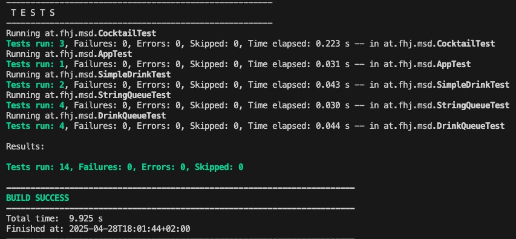

# DrinkQueueProject
 
## Overview
This project was created for the Configuration Management course.  
It implements a queue structure for drinks and includes:
 
- DrinkQueue
- DoubleQueue
- Cocktail
- SimpleDrink
- StringQueue
 
The project also includes unit tests, JavaDoc documentation, and a Maven Site.
 
---
 
## How to Run Tests
 
Tests are written with JUnit 5.  
You can run all tests with:
 
```bash
mvn clean test
```
 
Tests cover:
- DrinkQueue methods (offer, poll, peek, clear, isEmpty)
- Cocktail volume and alcohol percentage
- SimpleDrink functionality
- StringQueue behavior
 
---
 
## Maven Site
 
We built a Maven Site containing:
- JavaDoc documentation
- Test reports
- Markdown documentation (good_style.md, exercise7.md)
 
To build the site:
 
```bash
mvn clean site
```
 
The output is located in:
 
```
target/site/
```
 
---
 
## Screenshots
 
### Maven Site Home Page

 
### JavaDoc Example Page

 
### Test Report Page

 
---
 
## Group Members
 
- **Afik Eschel** – Unit Testing, Branch Management
- **Alena Vodopianova** – JavaDoc Documentation, DoubleQueue
- **Oleh Haievyi** – Maven Site Setup, Project Coordination
 
---
 
## Notes
 
- At least 6 Git branches were used.
- Each member worked on separate feature branches.
- Pull requests were created and reviewed by team members.
- Maven Site successfully built and verified.
- Screenshots from the final documentation are included.